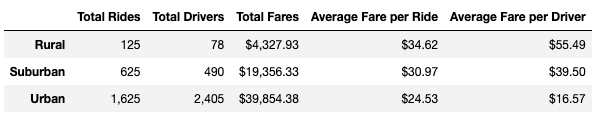
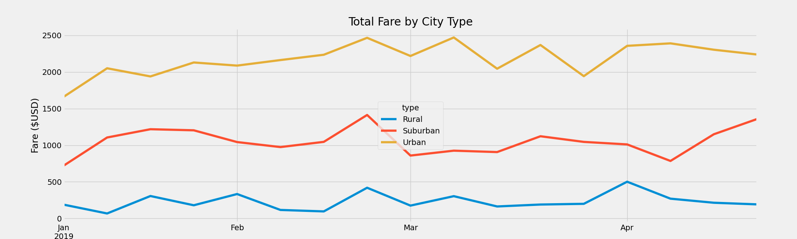

# PyBer_Analysis
DU_Analytics_Module 5 Repo

## Overview
The purpose of this analysis is to investigate how the ride-sharing system functions across different "city types".  These types include Rural, Suburban, and Urban with what distinguishes these groups from one another being determined outside of this analysis.  Therefore moving forward just understand that there was some kind of decision made on how to group cities it just will not be a part of this analysis since the value for city type was included in the data.

Specifically, we are interested in how the average fare per ride differs between each city type as well as how that fare changed over the course of a window of time, which in this case was January - April of 2019 and to visualize this we grouped the rides/fares by week.

## Results
After aggregating the data we can see in the table below that city type with the largest average fare was for type Rural with the average ride costing a little more than $34.  Compare this to the Urban city type which has the lowest average fare per ride at $24.53.  Similarly, the average Urban driver made $16.57 and the average Rural driver made $55.49 over the course of the period in question.  Yet the total fare or the total amount of money spent by customers significantly higher in the Urban city type compared to either of the other types.  This was in large part due to a similar difference in the total number of Rides between the city types again with Urban at 1625 rides, Suburban at 625 rides, and Rural at only 125 rides.  The difference in fare per driver is most likely due to the abundance of drivers in Urban areas at 2405, 490 for Suburban areas, and only 78 in Rural areas.

## Summary
Based off the analysis that we have done here I would recommend the follwing steps be taken 
1. Do additional promotion of the ride sharing app in all city types, however the number of drivers will need to be increased in both Rural and Suburban cities.  The large disparity in fare per ride compared to Urban cities seems to be a result of the differences in supply and demand.  Urban cities obviously have a high demand, however the supply of drivers is even higher with 1625 rides divided by 2405 drivers giving us .676 rides per driver.  For Suburban this ratio becomes 1.28 rides per driver and Rural it is 1.60 rides per driver.  Trying to hire additional drivers to bring this ratio closer to 1 should help reduce potential reluctance of riders in those areas to choose our app.

2. Use past data to target promotions for each area, notice below how there seems to be a general increase in the amount of fare for all three city types from late January to about March.  This trend along with additional weekly spikes, seen below, could be used as an indicator of when riders need rides and would therefore be more willing to use our services if given the opportunity.

3. Break down the graphed results below into smaller chunks of time, ideally by the day, in order to understand some of the spikes we see.  For example, are some of the spikes simply caused by weekend travelers?  How do holidays fit into this picture?  This weekly view is a good starting point to get a wide view but it would be important to do some deep dives on smaller snapshots of time to get a better understanding of customer habits.

